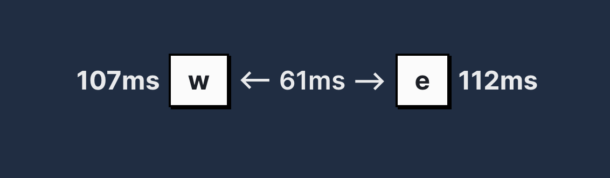

# timing-calculator

How long does actually 250ms feel like? 100ms? What about 89? Well now you can finally find your answer. Made just as a super simple tool to dial in timings in my [ZMK config](https://github.com/IsakLarsson/temper-zmk-config).
[Avaliable here](https://genuine-sorbet-66e2f8.netlify.app)

